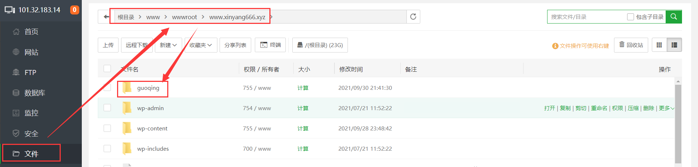
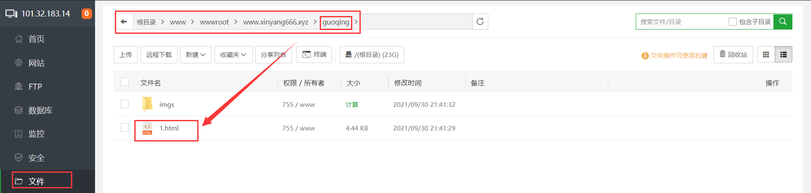

# 一、 先看效果：
|  |  |  |  |
| ------------------ | ------------------ | ------------------ | ------------------ |
|  |  |  |  |

+ 生成此效果的网页链接：https://www.xinyang666.xyz/guoqing/1.html

# 二、将此部署到服务器的过程：

## 1. 将文件传输到服务器（注意传输到自己网站域名对应的根目录，类似下面这种形式）

## 2. 找到访问网址

根据html文件名，可知访问的地址为：https://www.xinyang666.xyz/guoqing/1.html
